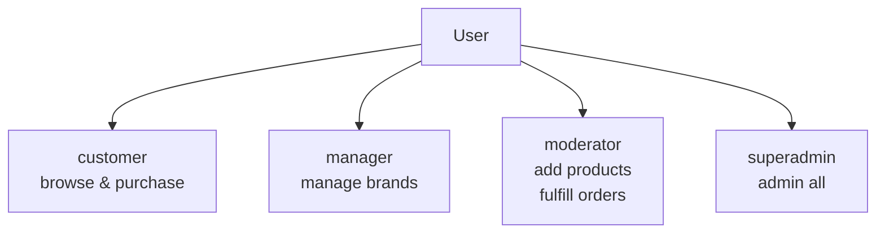
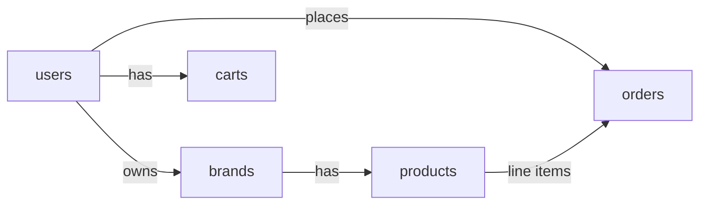
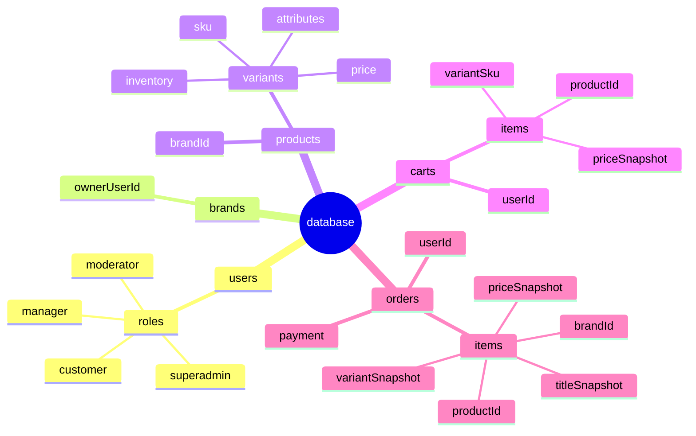

# Database Schema (Document DB)

This is a visual, high-level representation of the collections and relationships.

## Roles (User Capabilities)

## Collections and Relations (Overview)

## Document Structure (Tree View)

## Notes

- Relations are references by ID (document DB style).
- Orders store snapshots to keep history immutable.
- Role permissions are enforced in application logic.
